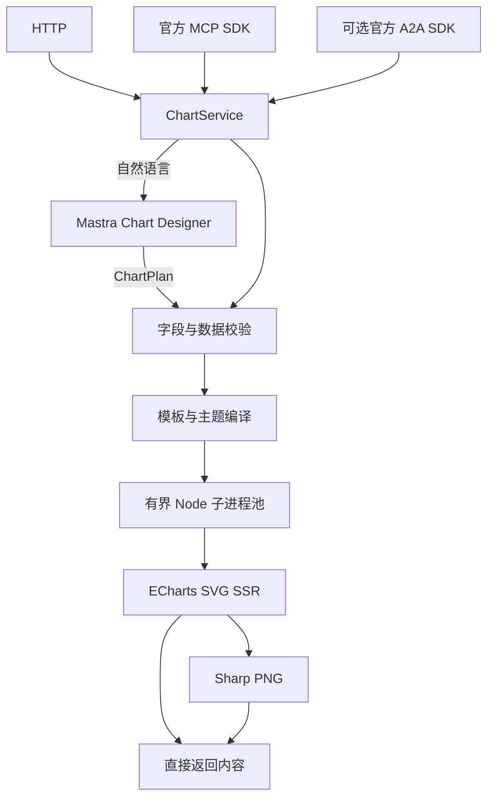

# ECharts Agent 设计与冻结合同

状态：Implemented（2026-09-16）；版本 0.1.0。实现真相源是 `src/contracts.ts`、`src/service.ts` 和协议适配器；验收见 [验证记录](../verification/2026-09-16.md)。

## 范围与架构

支持两种结构化输入：ECharts JSON option；数据＋图表类型/风格的 ChartSpec。输出 SVG/PNG 完整内容，由调用方保存。一个 Node 容器和一个端口；没有文件托管、浏览器、数据库、Redis、对象存储或外部数据抓取。

HTTP 和 MCP 不依赖 LLM。可选 Mastra Chart Designer 根据结构化数据和意图生成字段映射，再由程序绑定原始数据。A2A 是后续阶段完成的可选入口，默认关闭。

### 已验证的技术选择

| 组件 | 锁定版本/合同 |
| --- | --- |
| Node | 24.16.0；Docker base manifest digest 见 Dockerfile |
| Fastify / TypeScript / Zod | 5.12.4 / 7.0.2 / 4.6.5 |
| ECharts / Sharp | 6.1.0 / 0.35.4 |
| Mastra core / OpenAI compatible adapter | 1.67.0 / 3.0.49 |
| 官方 MCP SDK | 1.30.0；已测协议修订 2025-11-25 |
| 官方 A2A SDK | 0.3.14；wire 0.3.0，与当前 Mastra 依赖版本一致 |
| 首家实测 Provider | 阿里云百炼；qwen3.8-flash；OpenAI-compatible endpoint |
| 中文字体 | Noto Sans CJK SC；固定提交、SHA256、OFL 许可见 assets/fonts |

R0 探针发现 Mastra MCP 高层封装会将无 outputSchema 的工具响应转换为 JSON text；带 outputSchema 时又将整个 content/structuredContent 包装体按 metadata schema 验证，无法满足本项目 PNG image content 合同。实施采用官方 MCP SDK；A2A 也使用官方协议 adapter。Mastra 保留负责 Agent 与受约束生成，不自动开放 Studio、Agent 管理或工作流接口。

## HTTP 与输出

| 路径 | 请求 | 成功结果 |
| --- | --- | --- |
| POST /v1/render | `{option,style?,output?}` | SVG/PNG 二进制/文本 |
| POST /v1/charts | `{spec,style?,output?}` | SVG/PNG 二进制/文本 |
| POST /v1/generate | `{data,intent,style?,output?}` | `{requestId,spec,option,warnings,artifact}` |
| GET /v1/capabilities | 无 | 能力、限额、AI 配置状态 |
| GET /openapi.json | 无 | 共享 Zod Schema 生成的 OpenAPI 3.1 |
| GET /health/live | 无 | 进程存活 |
| GET /health/ready | 无 | Worker 就绪与池统计；不可用时503 |

`output` 默认 `{format:"svg",width:960,height:540,pixelRatio:1}`。格式仅 svg/png；宽 240–2400，高 180–2400，pixelRatio 1–3，计算后的像素尺寸必须为整数，PNG 总像素不超过16,000,000。SVG 只接受 pixelRatio=1。

`artifact` 包含 `mimeType,width,height,bytes`；另有 `svg` 原文或 `base64` PNG。尺寸为最终像素/逻辑 SVG 尺寸。图像 HTTP 响应带 `Content-Disposition: attachment`、`Cache-Control: no-store`、`X-Content-Type-Options: nosniff`、`X-Request-Id`。HTTP/MCP不保留图像、不提供下载地址；可选A2A在短期内存任务中保留artifact，见后文。

错误：`{error:{code,message,requestId,details:[{path,reason}]}}`。details 不含输入值，字段路径脱敏。

| 状态 | 典型错误 |
| --- | --- |
| 400 / 401 / 415 | INVALID_JSON / UNAUTHORIZED / UNSUPPORTED_MEDIA_TYPE |
| 413 / 422 | REQUEST_TOO_LARGE、OUTPUT_TOO_LARGE / INVALID_INPUT |
| 429 | QUEUE_FULL、AI_BUSY |
| 499 | CANCELLED；通常客户端已断开 |
| 502 | RENDER_FAILED、WORKER_CRASHED、UNSAFE_OUTPUT、AI_FAILED、AI_INVALID_PLAN |
| 503 | WORKER_UNAVAILABLE、AI_UNAVAILABLE、SHUTTING_DOWN |
| 504 | RENDER_TIMEOUT、AI_TIMEOUT |

## ChartSpec / ChartPlan

ChartPlan 与 ChartSpec 的差别是没有 `data`，模型不能返回、修改或补写数据。顶层与 encoding 拒绝未知字段。

所有 ChartSpec 都包含 `type,data`，可选 `title`（最多180字）和 `labels`（字段到显示名，最多80字）。data 是1–10,000行对象数组，字段并集最多64个；值只允许有限 number 或最多512字的 string，拒绝 null、缺失的已引用字段和空数据。字段名最长64，字母/中文/下划线开头，后续允许字母、数字、空格、下划线、连字符；禁止原型键。

| type | encoding | 可选参数及语义 |
| --- | --- | --- |
| bar / line | `{x:string,y:string[]}` | `xType:category\|time`（默认category）；`horizontal,stacked,area` 默认false。area 仅 line 有效 |
| pie | `{name:string,value:string}` | `donut` 默认false；value 非负，至少一个正数 |
| scatter | `{x:string,y:string}` | x/y 都是有限数值 |
| radar | `{name:string,metrics:string[]}` | 3–20个不同指标、最多20行，所有值非负；可选正数 max，不得小于真实值 |

新增七类 ChartSpec 的字段与限额见本文末尾的静态图表扩展合同。

bar/line 最多20个不同 y 字段，行×指标总数据点不超过10,000。分类值必须非空且唯一，按传入顺序展示；不隐式求和、分组、排序或填充。数字分类按字符串标签呈现，`1` 与 `"1"` 视为重复。time 使用 ISO 日期，禁止横向；传入时间顺序由调用方决定。雷达图未指定 max 时统一按数据最大值的1.1倍设定，最低尺度1.1。

## option 与 style

option 直传支持 bar/line/pie/scatter/radar/gauge/funnel/heatmap/tree/treemap/sunburst/sankey，并要求 series/data 非空；这不是全量 ECharts option schema，也不代表浏览器交互功能可用。

style：`theme:light|dark|report`，可选 palette（1–20个十六进制颜色）、fontSize（10–32，默认14）、background（十六进制颜色或transparent）。默认实色背景，固定基础中文字体。

配置优先级：默认主题→style→显式 option，数组整体替换。最终强制 `animation:false`、静态 tooltip、系列 silent、UTC 时间。ChartSpec 模板为标题、图例和绘图区预留空间，长标签可截断；不保证任意密集图例/极长多行标题自动排版。

JSON 深度≤24、节点≤100,000、单字符串≤4096、请求体≤1MiB、series≤20、数据点≤10,000。禁止原型键、函数/函数源码、custom、graphic、dataset、dataZoom、toolbox、timeline、media、图片/URL/file/data URI、插件等资源入口。visualMap 仅允许无交互的 continuous 类型、有限递增范围、指定 seriesIndex/dimension、十六进制色带与受限排版字段，其他字段拒绝。该策略偏保守：普通文本内的 URL 或函数语法也会拒绝。

ECharts 输出 SVG 经 XML 解析和主动内容校验，拒绝 DOCTYPE/ENTITY/script/foreignObject/image/事件属性/外链，只允许内部 fragment 引用。单图像≤10MiB；MCP/A2A 包装后的 base64 响应亦检查10MiB，超限时明确报错，不能截断。

## 渲染生命周期

主进程负责 I/O，每个 Worker 同时执行一个任务。默认2 Worker、等待队列8、总截止10秒（含排队）。Worker 只继承 PATH/TZ/LANG/NODE_ENV，不继承模型凭据；V8 heap 上限256MiB，Sharp 单线程且关闭缓存。每次独立创建 ECharts 实例并在 finally dispose。

超时/请求连接取消时 SIGKILL 当前 Worker，等待 exit 后补充；队列中的任务取消不杀其他 Worker。30秒内连续5次退出后停止补充，readiness失败，需要检查原因并重启服务。SIGTERM/SIGINT 停止任务、回收 Worker，tini 保证容器信号处理。

Node heap 不包含 Sharp native 内存，子进程不是完整安全沙箱。容器总 OOM 仍可能终止服务；默认2 Worker 应结合部署内存和真实图表压测调整。已测768MiB/2CPU只是样例验收规格，不是所有输入下的内存保证。

## 可选 LLM

只接受已有结构化数据＋最多2000字意图，不抓网页、不访问数据库、不解析文件，也不从描述虚构业务数值。模型接收字段类型、行数、前5行样例（字符串最多160字）和意图，不接收完整大表。

模型输出受约束 ChartPlan，由程序校验字段、绑定原始 data、编译并渲染。本地计划校验失败允许一次修正，总调用≤2；Provider/传输错误直接失败，SDK自动重试为0。默认总时限60秒、并发2（无生成等待队列）。取消信号传递给 Provider 和渲染进程池。无 memory、RAG、多 Agent 循环或持久任务队列。

配置由部署者提供，请求不能提交任意 Provider URL/key。完整配置才实例化模型，强制关闭时不实例化、不联网；配置不完整状态misconfigured，只影响生成入口。配置ready不表示已探测供应商在线。基础 readiness 只依赖渲染能力。

日志仅含 request ID、注册路由、状态、耗时；不打印 option、data、prompt、密钥和原始 Provider 异常。真实模型只实测了百炼，其他 OpenAI-compatible 端点不自动视为兼容。

## MCP 与 A2A

MCP `/mcp` 为无状态 Streamable HTTP，每个请求独立协议实例。基础工具 `get_chart_capabilities/render_echarts/render_chart`，AI配置完整时增加 `generate_chart`。使用实际 SDK 客户端验证了握手、列工具、SVG text、PNG image 与 structuredContent。每次请求独立校验 Bearer；会话ID不能替代认证。执行中的断连会取消下游；独立的notifications/cancelled在无状态请求之间不提供关联保证，需要按任务ID取消时使用A2A。没有持久会话或跨请求恢复。

A2A 默认关闭，必须配置 SERVICE_API_KEY、A2A_ENABLED=true、A2A_PUBLIC_URL（不含路径、query、凭据的 origin）。Agent Card 在 `/.well-known/agent-card.json`，JSON-RPC 在 `/a2a`。仅 message/send、tasks/get、tasks/cancel；消息为一个 data part `{operation:render|chart|generate,request:对应HTTP请求体}`，task ID 由服务生成。

blocking 默认true；false时先返回working任务，可再查询/取消。完成 artifact 通过 file.bytes 返回，SVG也编码为base64。失败任务含安全错误码。任务历史不写入存储；任务与artifact在内存最多100条、序列化内容合计64MiB，完成后最多保留10分钟，空间紧张提前淘汰终态任务。重启即丢失，不支持续写/恢复/文件URL输入/streaming/push。

一个静态 key 表示共同信任域；持有同一 key 的调用方可读取该信任域的任务。不提供租户身份隔离、OAuth 或公开多用户服务合同。健康检查匿名，其余所有协议入口都需要 key（显式本地匿名仅适用于 HTTP/MCP）。

## 验收与暂缓

自动化测试覆盖十二类SVG/PNG、中文/主题、数值与错误、真实MCP/A2A客户端、Worker真实终止与恢复、模型适配器请求计数、总时限/取消。Docker分别验证Linux arm64与amd64（本机仿真），含断网渲染、真实百炼生成、非root/只读根、正常停止。证据详见 [首版验收记录](../verification/2026-09-16.md) 和 [新增类型验收记录](../verification/2026-09-16-extended.md)。

暂缓：PDF/JPEG/WebP、交互HTML、地图/GL/custom、上传解析/数据连接器、图库与下载链接、多租户/计费、批量持久队列、多Agent视觉优化、SVG字体内嵌或转路径。SVG依赖接收方字体，PNG固化字形；不承诺全部Unicode覆盖或不同平台像素一致。

## 资料

设计阶段2026-09-16在线核对，实施以锁定版本源码与实际运行证据为准：

- [ECharts SSR](https://echarts.apache.org/handbook/zh/how-to/cross-platform/server/)
- [参考 echarts-server](https://github.com/mengweijin/echarts-server)（只参考渲染链路，不直接复用其资源隔离方案）
- [Mastra 结构化输出](https://mastra.ai/docs/agents/structured-output)
- [官方 MCP SDK](https://github.com/modelcontextprotocol/typescript-sdk) · [2025-11-25 tool content](https://modelcontextprotocol.io/specification/2025-11-25/server/tools)
- [官方 A2A SDK](https://github.com/a2aproject/a2a-js) · [A2A 0.3.0](https://a2a-protocol.org/v0.3.0/specification/)
- [Sharp 输入限制](https://sharp.pixelplumbing.com/api-constructor/)

## 静态图表扩展合同（2026-09-16，Frozen）

用户追加要求扩展静态内置图表，明确排除地图、GL、自定义脚本和动态交互。本次新增 gauge、funnel、heatmap、tree、treemap、sunburst、sankey，HTTP/MCP/A2A及可选模型使用同一合同，原5类接口保持兼容。

- gauge：`encoding:{name,value}`，一行数据；min默认0、max默认100，真实值须在范围内；unit可选，不自动推断百分比或缩放。
- funnel：`encoding:{name,value}`，唯一类别、非负数、至少一个正数；保留传入顺序，不自动排序。
- heatmap：`encoding:{x,y,value}`，分类x/y按首次出现顺序；同一坐标只能一行，不填补缺失格、不聚合；数值允许负数。连续visualMap仅开放受约束的安全字段。
- tree：`encoding:{id,parent,name}`，value可选；treemap/sunburst同结构但value必填。所有节点id非空唯一，parent用空字符串表示唯一根；其余parent须存在，无环且全部可达。父节点指定的value不得小于其直接子节点数值之和，允许机器精度内的求和舍入误差，保持原始数值；不凭模型补写父节点或数值。
- sankey：`encoding:{source,target,value}`；来源/去向为非空字符串，数值严格大于0；禁止自环、重复边和有向环；程序从边表中按首次出现顺序推导节点。
- 层级图最多1000节点、深度8层；桑基图最多500节点/2000条边；这些限制也覆盖option直传，且总数据点预算仍有效。

验证：逐类SVG/PNG、原数值、语义失败路径、安全策略；真实HTTP/MCP/A2A、百炼生成与容器定向smoke。验收后追加证据，不修改此前验收结果。
